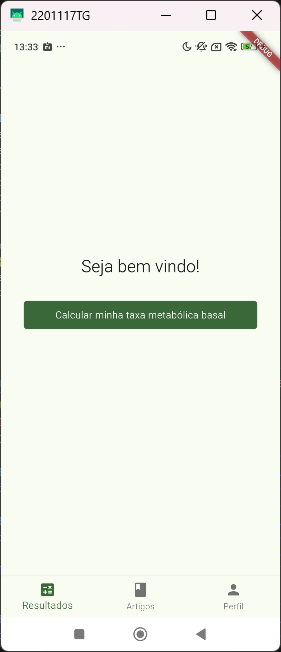
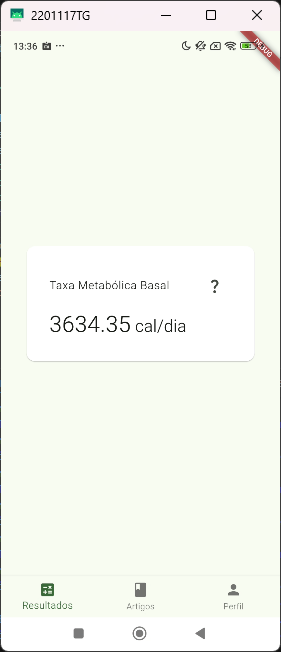
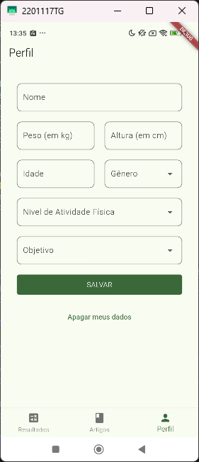
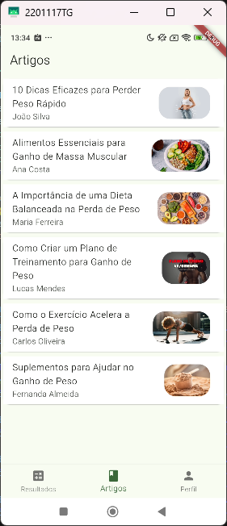
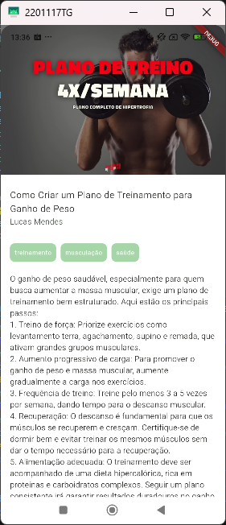

# Calorias Diária

## Sobre o App

O aplicativo **Calorias Diária** é uma ferramenta útil para quem deseja gerenciar sua ingestão calórica diária. Ele oferece as seguintes funcionalidades:

- **Cálculo de TMB (Taxa Metabólica Basal)**: Calcule sua TMB com base em suas informações pessoais.
- **Armazenamento Local**: Todos os dados são armazenados localmente no seu dispositivo, garantindo privacidade e acesso rápido.
- **Artigos Informativos**: Acesse artigos relevantes para ajudar a alcançar seus objetivos, seja ganhar ou perder peso.

O aplicativo foi desenvolvido utilizando Flutter na versão 3.22.3

## Screenshots

Aqui estão algumas capturas de tela do aplicativo **Calorias Diária**:

### Tela Inicial

    
    

### Cálculo de TMB

    
    

### Artigos Informativos

    
    

## Como Baixar

Para baixar o aplicativo, clique no link abaixo:

[Baixar Calorias Diária](https://drive.google.com/drive/folders/1voP4UzCD8_aAQd-RwnvpchvTUF6H2Et_?usp=sharing)

## Funcionalidades

- **Cálculo de TMB**: Insira suas informações pessoais para calcular sua TMB.
- **Armazenamento Local**: Seus dados são salvos localmente para fácil acesso.
- **Artigos para Leitura**: Leia artigos que ajudam a alcançar seus objetivos de ganho ou perda de peso.

## Contato

Para mais informações, entre em contato conosco pelo e-mail: nichoalsvpinheiro@gmail.com
